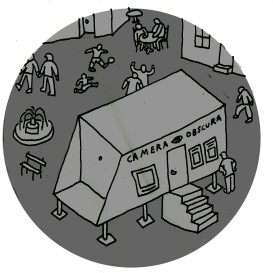

# Camera Obscura
### travail en cours

*Camera Obscura* est un projet de théâtre optique itinérant de la Cie Nokill dont la première est prévue pour l'été 2024. 

Sur ce site nous rassemblons au fur et à mesure de la création, tous les contenus artistiques et techniques qui nous sont utiles. 

Même si à la base cette documentation est un outil de travail personnel, nous avons décidé de la mettre à disposition de toute personne intéressée par ce projet.

- [Dossier de création](contenu/dossier/dossier-camera-obscura-2024-web.pdf), télécharger le dossier en pdf.
- [Prototypes](contenu/prototypes), liste des Cameras obscuras construites pendant la création.
- [Écriture](contenu/ecriture), textes, scenarios, découpages et références.
- [Technique](contenu/technique), questions et réponses concernant les differents défis techniques. 
- [Production](contenu/production.md), partenaires du projet et calendrier des résidences.
- [Bibliographie](contenu/bibliographie.md), liens et documents utiles.
- [Todo](contenu/todo.md), bloc-notes des trucs à faire.

