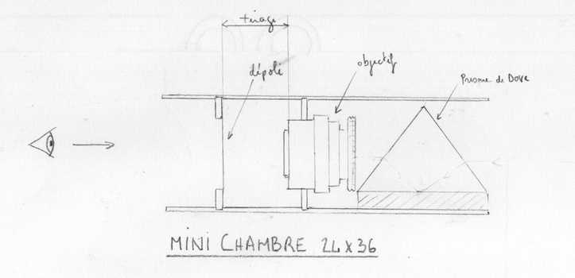

#  Mini Camera obscura

## Description générale
En regardant à l'intérieur de cette camera obscura, on découvre une image à l'endroit d'environ 4 cm x 4 cm de ce qui est devant nous.

## Allure
Une boite noire de forme parallélépipédique. L'image est projeté sur un dépoli à l'arrière du tube. Un prisme de Dove est placé devant l'objectif.

## Matériaux

### Parrois
- Carton-bois

### Écran
- Toile de retroprojection (translucide/dépoli) tendue sur cadre acier

### Objectif
- objectif 24x36 monture M42 (Helios 44-2 / 2/58mm) 

### Accessoires
- L'objectif et le dépoli sont fixés sur des planchettes maintenues dans des rigoles.

## Évaluation des avantages et des inconvénients

### Avantages
- très leger
- parfait pour des tests

### Inconvénients
- image petite et inversée

## Améliorations envisagées
- placement d'un prisme de dove devant l'objectif pour retourner l'image

## Moment envisagé pour la construction et/ou les améliorations
printemps 2023

## Détails de construction et description technique
