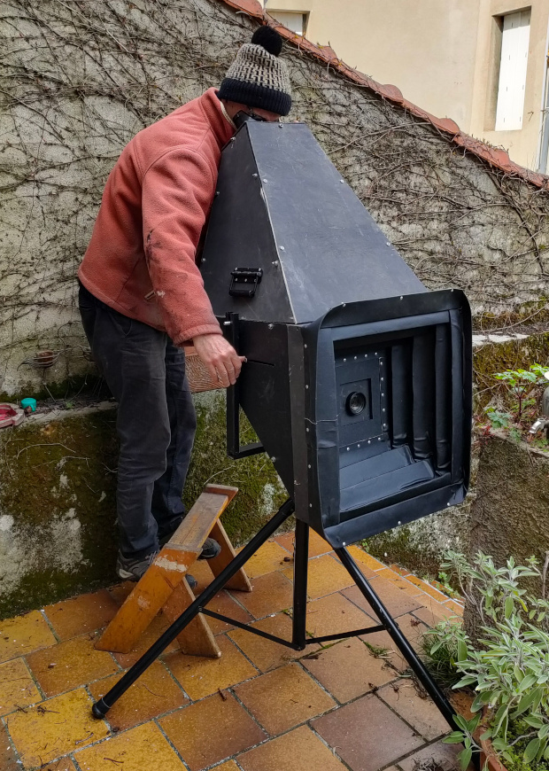
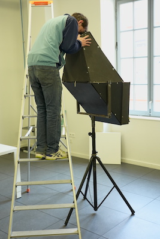
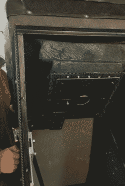
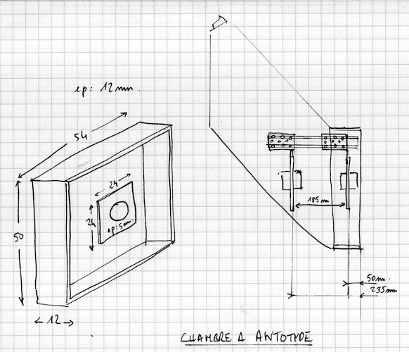
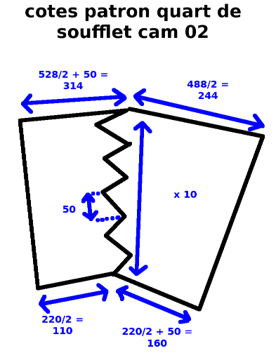

#  Chambre à Antotype

| prototype n°                |                   02 |
|-----------------------------|---------------------:|
| nom vernaculaire            |   Chambre à Antotype |
| début construction          |        décembre 2022 |
| nombre de spectateur·ices   |                    1 |
| taille de l'image           |             50×50 cm |
| distance de tirage min-max  |      environ 35-55cm |
| dimensions exterieures      |                    ? |
| objectif monté              | Process lens APO RONAR RODENSTOCK 9/360 mm |

## Description générale

En regardant dans le viseur situé au dessus de cette camera obscura, on découvre une image à l'endroit d'environ 50 cm x 50 cm de ce qui est devant nous.

L'écran est amovible et peut être remplacé par une plaque sur laquelle on aura disposé un papier photo-sensible type antotype.

## Allure

Une boite noire de forme complexe est fixée sur un pied de projecteur. La forme évoque les chambres moyen-format type rolleiflex. Sur le dessus, on trouve un viseur en forme de lunettes de protection. À l'avant, un soufflet en skaï noir.

## Matériaux

### Chassis
- Tube d'acier soudé (20 mm x 20 mm).

### Parois
- Panneau de plastique alvéolaire et contreplaqué 5 mm

### Écran
- Toile de rétroprojection (translucide/dépoli) tendue sur cadre acier

### Objectif
- Process lens APO RONAR RODENSTOCK 9/360 mm

### Accessoires
- La planchette de l'objectif est montée sur un rail Igus. Sur le côté exterieur de la chambre, une vis permet de régler la mise au point en entrainant la planchette.
- Un soufflet entre la planchette et le chassis maintient l'obscurité dans la boite.

*Vue interieur du mécanisme de réglage de mise au point*

## Évaluation des avantages et des inconvénients

### Avantages
- image dans l'axe
- à l'endroit

### Inconvénients
- visée par le dessus
- peu clair

## Améliorations envisagées
- peinture du chassis
- vitre de protection et pare-soleil
- fixation des lunettes
- achat objectif plus lumineux

## Moment envisagé pour la construction et/ou les améliorations
printemps 2023

## Détails de construction et description technique

### Soufflet

- [Patron soufflet en dxf](/contenu/plans/soufflet-cam02.dxf)
- [Patron soufflet en pdf pour aperçu](/contenu/plans/soufflet-cam02.pdf)

cotes :

- Grand cadre : 528mm x 488mm (collage interieur)
- Petit cadre : 220mm x 220mm (collage contre)
- Largeur plis : 50mm
- nombre de plis : 10

