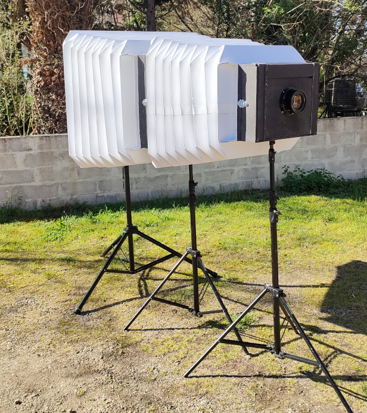
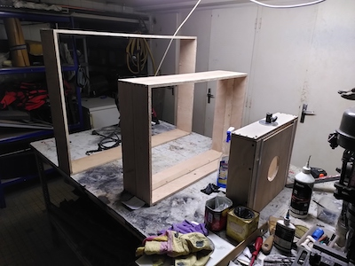
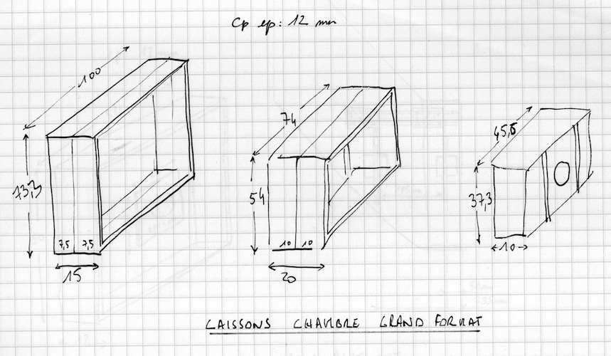
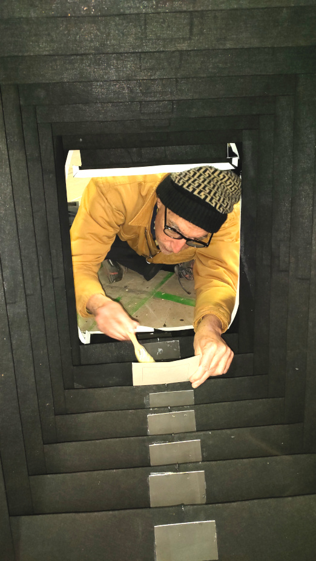

#  Chambre grand format

| prototype n°                |                   03 |
|-----------------------------|---------------------:|
| nom vernaculaire            | Chambre grand format |
| début construction          |            mars 2023 |
| nombre de spectateur·ices   |                    1 |
| taille de l'image           |            100×73 cm |
| distance de tirage min-max  |                    ? |
| dimensions exterieures      |                    ? |
| objectif monté              | Process lens NIKON APO NIKKOR 9/610mm |

## Description générale

En regardant dans le viseur situé à l'arrière de cette camera obscura, on observe une image à l'envers d'environ 100 cm x 73 cm (format 1,37) de ce qui est devant nous.

## Allure

Une boite noire de forme pyramidale couchée, fixée sur un pied de projecteur fait office de viseur de champ. Elle est prolongée par un long soufflet blanc construit en deux parties et se termine par le support de l'objectif, lui-même fixé sur un pied. La forme évoque les chambres photographiques ultra grand format. Un pied intermédiaire limite l'affaissement du soufflet.

## Matériaux

### Chassis
- Tube d'acier soudé (20 mm x 20 mm).

### Parois
- Contreplaqué 5 mm

### Écran
- Toile de rétroprojection (translucide/dépoli) tendue sur cadre bois

### Objectif
- Process lens NIKON APO NIKKOR 9/610mm

### Accessoires

- Pour retourner l'image, il est envisagé d'utiliser un prisme en toit d'Amici, fabriqué avec 2 miroirs à 90°.

## Évaluation des avantages et des inconvénients

### Avantages
- image dans l'axe
- grand format
- grande amplitude de réglage du tirage

### Inconvénients
- encombrement
- à l'envers

## Améliorations envisagées

- fabrication et fixation soufflet carton/tissu/cuir
- peinture du chassis

## Moment envisagé pour la construction et/ou les améliorations
printemps 2023

## Détails de construction et description technique

### Soufflet

- [Patron soufflet A en dxf](/contenu/plans/soufflet-cam03-A.dxf)
- [Patron soufflet A en pdf pour aperçu](/contenu/plans/soufflet-cam03-A.pdf)
- [Patron soufflet B en dxf](/contenu/plans/soufflet-cam03-B.dxf)
- [Patron soufflet B en pdf pour aperçu](/contenu/plans/soufflet-cam03-B.pdf)

Grand Soufflet :

- Grand cadre : 1000mm x 733mm (collage exterieur)
- Petit cadre : 740mm x 540mm (collage exterieur)
- Largeur plis : 100mm
- nombre de plis : 16

Petit Soufflet : 

- Grand cadre : 740mm x 540mm (collage exterieur)
- Petit cadre : 456mm x 373mm (collage exterieur)
- Largeur plis : 100mm
- nombre de plis : 16

