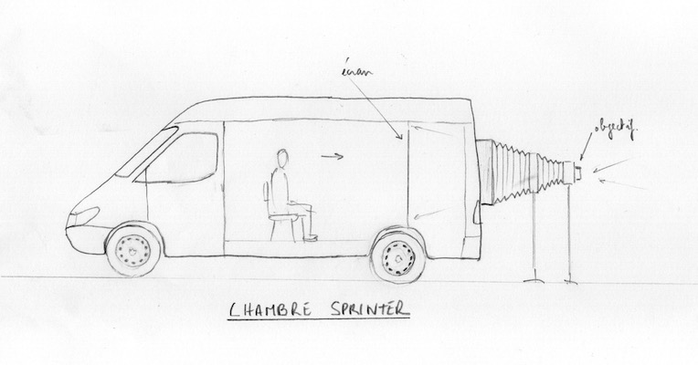
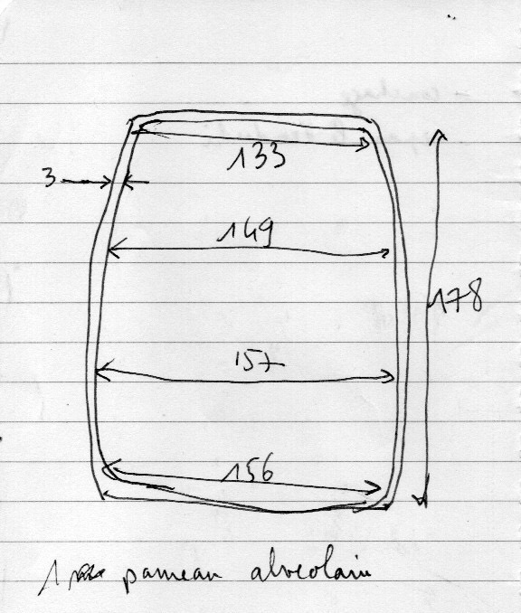

#  Chambre Sprinter

## Description générale
Un vehicule type Sprinter Mercedes est transformé en caméra obscura en adaptant l'arrière du véhicule pour qu'il accueille un système soufflet/objectif. Un cadre sur leque est fixé l'écran de 1,80 m x 1,31 m (format 1,37) est fixé à l'intérieur du camion. 6 personnes peuvent visionner simultanémant l'image.

## Allure
Un utilitaire avec un soufflet qui dépasse à l'arrière.

## Matériaux

### Chassis
- Sprinter Mercedes

### Écran
- Toile de retroprojection (translucide/dépoli) tendue sur cadre

### Objectif
- Process lens Wray Lustrar 16/1075mm Apo

### Accessoires
- Pour retourner l'image, il est envisagé d'utiliser un prisme de toit d'Amici, fabriqué avec 2 miroirs à 90°.

## Évaluation des avantages et des inconvénients

### Avantages
- image dans l'axe
- ultra grand format

### Inconvénients
- à l'envers

## Améliorations envisagées

## Moment envisagé pour la construction et/ou les améliorations
printemps 2023

## Détails de construction et description technique

