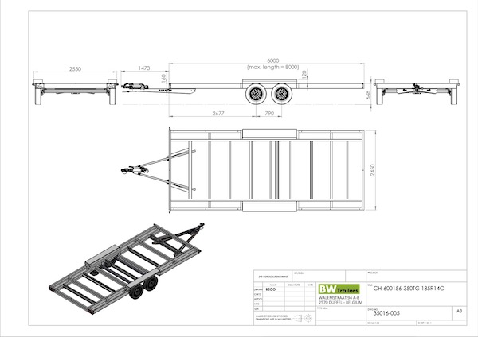
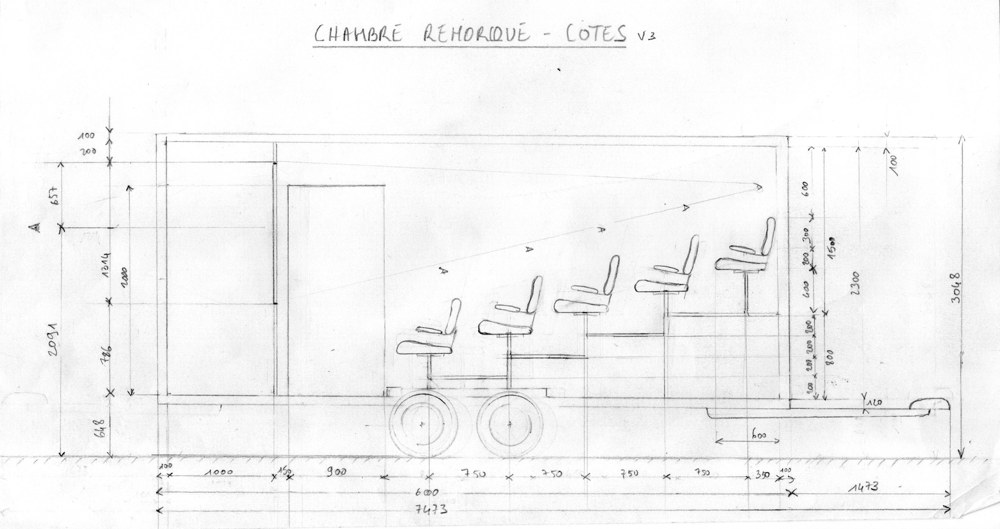

#  Chambre Remorque

## Description générale
Une remorque est transformée en cinéma itinérant en adaptant l'arrière du véhicule pour qu'il accueille un système soufflet/objectif. Un cadre sur lequel est fixé l'écran de 1,80 m x 1,31 m (format 1,37) est installé à l'intérieur de la remorque. 20 personnes assisent sur un gradinage peuvent assister simultanémant à la projection.

*Vue de la remorque, un&middot;e opérateurice sur le toit pour les effets spéciaux et les marionnettes ; un&middot;e derrière l'écran pour le système optique principal et le son ; le public est réparti sur 5 rangées de sièges*

## Allure
Une remorque avec un soufflet qui dépasse à l'arrière.

## Matériaux

### Chassis
- Remorque BW TINY HOUSE CH 600 et charpente alu.

### Écran
- Toile de rétroprojection (translucide/dépoli) tendue sur cadre

### Objectif
- à définir

### Accessoires
- Pour retourner l'image, il est envisagé d'utiliser un prisme en toit d'Amici, fabriqué avec 2 miroirs à 90°.

## Évaluation des avantages et des inconvénients

### Avantages
- image dans l'axe
- ultra grand format
- très confortable

### Inconvénients

## Améliorations envisagées
- trappe entre salle et cabine (sous l'écran)
- hublots avec fermeture (iris ?)
- trappe entre cabine et extérieur avec sas.
- rideau sur l'écran ?
- système de ventilation mécanique
- système de refroidissement paille/eau
- porte PMR 90 cm
- retourner la flèche

## Moment envisagé pour la construction et/ou les améliorations
automne 2023

## Détails de construction et description technique

dimension hors-tout caisse + chassis : 7473 x 2450 x 3048

dimension hors-tout caisse : 6000 x 2450 x 24000

dimension utile intérieur : 5800 x 2250 x 2300

épaisseur isolation plafond ou mur : 100

épaisseur isolation sol : 120

entraxe siège mini : 500

largeur traversée mini : 350

assise mini : 500

hauteur dossier : 700

largeur accoudoir : 60

[plan chassis remorque](../plans/doc_bw_tiny_house_ch600.pdf)

