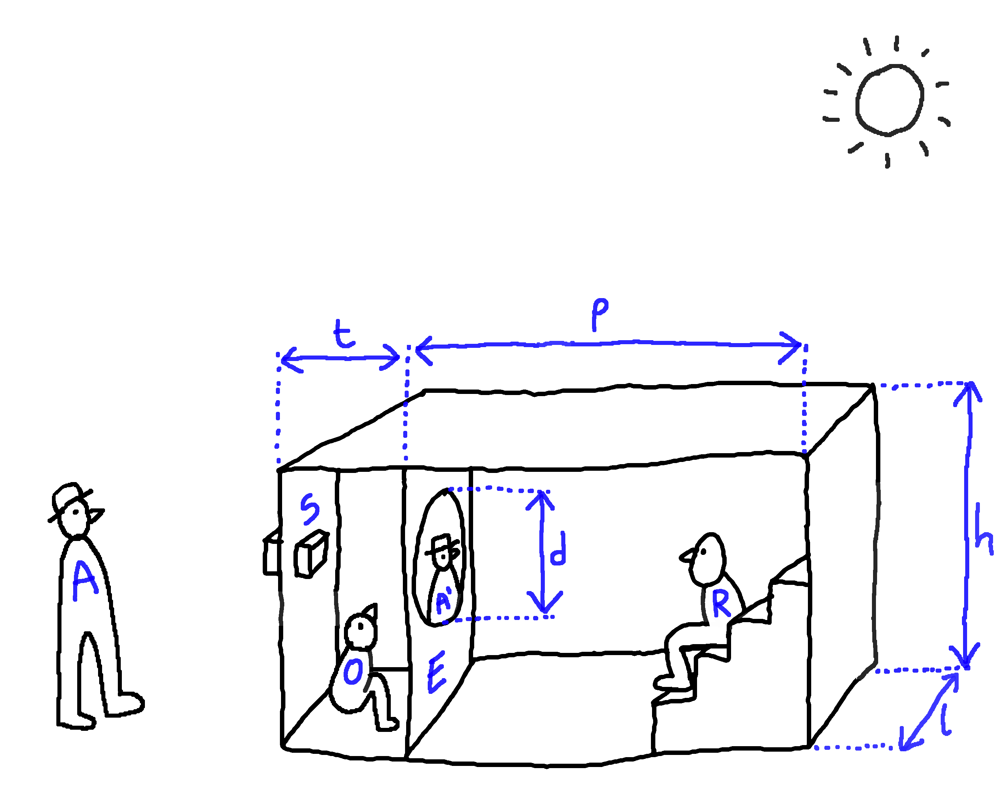

# Camera obscura - Questionnements et besoins techniques

Camera Obscura est un spectacle de rue qui plonge le spectateur dans un dispositif cinématographique ancestral, sans pellicule, ni vidéo, ni électricité, et qui n'utilise comme énergie que celle du soleil et des comédiens. Le public s'installe dans un lieu fermé, une chambre noire (camion ou remorque), et assiste à la projection d'un film dont les images sont des captations du monde extérieur qui transitent par un dispositif optique fait d'objectifs, de prismes et de miroirs. Les sons et la musique sont produits et interprétés en direct grâce à un ensemble d'instruments acoustiques et mécaniques : gramophones, automates sonores, cymbalum, tuyaux et pavillons acoustiques.

En résumé, l’enjeu principal de cette création est de créer l’illusion de la projection d’un film sans se brancher sur le courant. Vous trouverez plus de contenus et d'intentions artistiques dans le dossier de création en pièce jointe.

Nous avons identifié 3 domaines pour lesquels nous recherchons des partenariats (compétences, matériaux et conseils de mise en œuvre) :

- L’optique (voir 1. Image)
- L’isolation thermique (voir 2. Chaleur)
- L’accoustique (voir 3. Son)

## 0. Cahier des charges général

Voici quelques indications générales sur les partis pris et les choix technique qui dans cette création.

### 0.1. Reproduire les codes du cinéma

À la base de la plus-part des questions évoquées ici, il y a la volonté de reproduire un maximum de codes du cinéma pour faire vivre au public l’experience d’une projection.

À l’image ça ouvre les questions de montage de l’utilisation de differents axes de prises de vue, de differentes échelles de plan, et l’enchainement de ces differentes valeurs avec des transitions (cut, fondu, etc.). Mais sussi les questions de trucages et d’effets visuels.

Au son ça ouvre, entre autre, les questions de musique, de voix off et de bruitage.

### 0.2. Mobilité du dispositif

Le dispositiaf doit être mobile et sera construit sur un chassis de remorque. Cela impose des contraintes de taille et de poid.

### 0.3. Le parti pris energetique

Une des idées fondamentale du spectacle est de s’imposer la contrainte de n’utiliser aucun apport d’énergie autre que la lumière du soleil est la force humaine. Cette contrainte est au coeur même du projet et permettra d’être diffusé même dans des endroits sans accès à l’electricité : au milieu du désert, sur une plage, etc.

En outre, l’utilisation d’énergie electrique de source photovoltaïque ou mécanique (force humaine) ne s’oppose pas directement à cette contrainte mais nous souhaitons si possible nous en passer pour ce spectacle.

### 0.4 Low-tech et récupération

Notre projet s’inscrit dans la continuité du travail de la Cie, où nous cherchons à utiliser des dispositifs simples et ancestraux sans renoncer aux imaginaires et aux formes que le progrès et la modernité à engendré.

Aussi, il nous semble important de privilégier au maximum la récupération de matériaux et d’objets obsolètes pour leur redonner vie au travers d’une démarche artistique.

### 0.5 Schéma simplifié du dispositif

 

A : Acteur	S : Système optique	O : Opérateur		E : Écran	R : Regardeur

t : tirage	p : profondeur		h : hauteur		l : largeur	d : diamètre de l’écran

## 1. Image

Les premiers essais ont été réalisés avec un process lens Zeiss tessar 5,6/300 chiné sur ebay.

Les process Lens étaient construits à l'origine pour des dispositifs de reproduction d’image et sont aujourd’hui utilisés par des photographes qui font du grand et du très grand format. Avec cet objectif on arrive à projeter une image de 60 cm de diamètre. La netteté est obtenue en plaçant l'écran à environ 30 cm de l'objectif. L'image est magnifique, relativement lumineuse et incroyablement définie. Bien entendu elle est inversée. Suite à ces premiers test, nous avons identifié plusieurs problèmes à résoudre :

- Obtenir un maximum de luminosité même par temps couvert

- Le problème du retournement de l’image

- Le calage de la distance entre l’objectif et l’écran et la taille de l'image

- La possibilité de régler la mise au point sur le sujet qui se trouve à l’extérieur

- La conception d’un système de surimpression optique

### 1.1. Luminosité de l’image

Nous souhaitons que l’image soit la plus lumineuse possible.

Le besoin d’avoir le maximum de luminosité est essentiel pour que l’experience soit réussie.

Nous avons identifié trois moyens d’actions:

- Choix des périodes de jeu.

- Luminosité du système optique.

- Obscurité de la salle.

#### 1.1.1.  Choix des périodes de jeu

Pour maximiser la luminosité de l’image la première chose à faire est de maximiser la luminosité du sujet filmé. Notre seule source de lumière étant le soleil, il sera necessaire de limiter les moments de jeu :

- plage horaire (e.g. de 11h à 16h)

- période de l’année (e.g. mai-septembre)

- conditions météo (ciel dégagé).

Ces conditions sont contraignante, nous souhaitons les assouplir au maximum en travaillant sur les deux points suivant.

#### 1.1.2.  Luminosité du système optique

Pour obtenir un maximum de luminosité, il est nécessiaire d’utiliser des très grandes lentilles.

Il semble essentiel d’utiliser des lentilles achromatiques, asphériques afin de limiter au maximum les aberrations et obtenir une bonne qualité d’image. Nous recherchons donc ce type de lentille, mais avec de très grands diamètres pour gagner en luminosité. Nous serions intéressés pour récupérer des éléments optiques issus de matériel obsolète (Matériel de laboratoire ?, vieux télescope géant ?, lunette astronomique ? etc.) et trouver des solutions pour les adapter à notre usage.

Il faut également être attentif aux pertes de luminosité engendrées par les miroirs ou prismes uttilisée pour retourner l’image (voir point 1.2.) et tenter de minimiser ces pertes (chercher les meilleures qualité de miroir / minimiser le nombre de miroirs)

#### 1.1.3. Obscurité de la salle

Cela ne changera pas la luminosité réelle de l’image mais la luminosité ressentie.

La salle où le public est installée doit être la plus obscure possible. Cela implique :

- Une parfaite étanchaité lumineuse de la salle.
- Les murs de la salle faits dans des materiaux sombres, reflétants très peu la lumière, afin que la lumière de l’écran “bave” le moins possible sur les murs.

### 1.2. Retournement de l’image

Sur l’image projettée le haut et le bas sont inversés, Il faut réussir à retourner l’image pour rétablir son orientation haut-bas. L’idéal serait d’éviter aussi une inversion droite-gauche mais ce n’est pas prioritaire.

Nous n’avons pas trouvé de de solution théorique fiable pour régler ce problème en dehors de l’utilisation de prismes géants de dove ou d’Abbe-Porro ou avec des miroirs de grande taille.

Nous nous demandons si une solution sans prisme ou miroir est possible ? Si nous sommes contraint d’utiliser des prismes ou des miroirs, comment se procurer de tels objets (taille très grande), et comment limiter la perte de luminosité due à leur utilisation.

### 1.3. Taille de l’image et distance de tirage

Nous aurions aimé une distance entre objectif et écran de au minimum 1 m pour des raisons pratiques d’implantation de l’écran dans la remorque et une taille d’image de 2 m de diamètre.

Une difficulté vient du fait que nous aimerions utiliser plusieurs objectifs avec des focales différentes, voire des renvois d’angle, et alterner leur usage avec un système de caches manuels afin de reproduire l’illusion d’un montage type cinéma où plusieurs plans différents s’enchaînent. Il faudrait donc trouver le moyen d’homogénéiser le tirage de tous ces objectifs et la taille des images obtenues.

### 1.4. Réglage de la mise au point

La possibilité de régler la mise au point sur le sujet qui se trouve à l’extérieur semble pouvoir être résoleu avec un système mécanique de translation de l’objectif sur son axe.

À trouver la bonne solution : simple, fiable et pratique

### 1.5. Surrimpression de diapo

Parmis les effets visuels et trucages que nous envisageons d’explorer, il y a l’idée d’un dispositif de surrimpression optique.

L’idée est de créer un système optique qui permettrait d'incruster un élément visuel venant soutenir la narration sur une petite partie de l’image. Nous imaginons un système de lentille placée à l’extérieur qui concentre la lumière du soleil, une fibre optique de gros diamètre qui transporte cette source vers un dispositif tyre mini-projecteur de diapo pouvant être manipulé à la main à l’intérieur de la remorque.

## 2. Chaleur

Camera Obscura est un spectacle de rue, diffusé en été, et nécessitant une bonne luminosité extérieure. La remorque va donc être placée en plein soleil et le problème du confort thermique des spectateurs est un point essentiel à régler pour la réussite cette création. Nous cherchons donc des solutions techniques qui répondent aux critères suivants :

- utilisation d’un isolant efficace, de faible épaisseur et de faible poids
- système de renouvellement de l’air à l’intérieur de la remorque
- rafraichissement de l’air

### 2.1. Isolation thermique

Nous souhaiton trouver un isolant efficace, de faible épaisseur et de faible poids

Les contraintes de dimensions (largeur) et de jauge (24 spectateurs) nous impose une épaisseur d’isolant très réduite. Nous imaginons que de tels matériaux sont utilisés en aéronautique et programmes spatiaux. Peut-être pouvons nous récupérer des lots obsolètes ou périmés d'isolants ?

En parallèles, nous envisageons un système démontable de toile tendue au dessus de la salle afin qu’elle ne soit pas directement exposée au soleil.

### 2.2. Renouvellement de l’air

Nous imaginons un système de gaines dont l’implantation permettrait une convection naturelle. Mais peut-être faut-il imaginer un ventilation mécanique et trouver une force pour l’animer (manivelle ou pédalier et volant d’inertie ?)

### 2.3. Raffraichissement de l’air

La mise en place d’un système de rafraichissement de l’air sans electricité semble compliqué à résoudre… Peut-être en utilisant un liquide sur la route du flux de ventilation ?

## 3. Son

Par rapport au projet de créer l’illusion d’un film, il nous semble important de recréer l’ambiance sonore perçue par le spectateur dans une projection moderne :

- effet de spatialisation sonore
- effet d’infra-basses

La question se pose aussi de l’isolation sonore. Pour diminuer le bruit venant de l’exterieur de la salle.

### 3.1. Spacialisation

Nous aimerions étudier la faisabilité d’un système de tuyaux et de pavillons pouvant acheminer et spacialiser des sources sonores produites acoustiquement dans la remorque : voix humaine, instrument, grammophone, etc.

### 3.2. Effet d’infra-basses

Pour reproduire les sensations physiques éprouvées dans une salle de cinéma, nous imaginons pouvoir faire « vibrer » les sièges à la façon d’un subwoofer. À étudier le faisabilité d’une vibration produite par frottement d’une came dentelée contre une butée, transmise de façon solidienne aux sièges des spectateurs, eux-mêmes fixés sur silent-blocs.

### 3.3. Isolation sonore

Conjointement aux soucis d’isolation thermique évoqués plus haut, il semble important pour l’immersion que les spectateurs soient un minimum protégé du bruit exterieur surtout que le spectacle sera surtout joué dans des environnements urbrains (voitures, passants, etc.).
